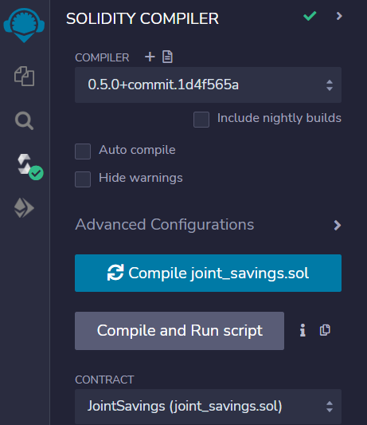
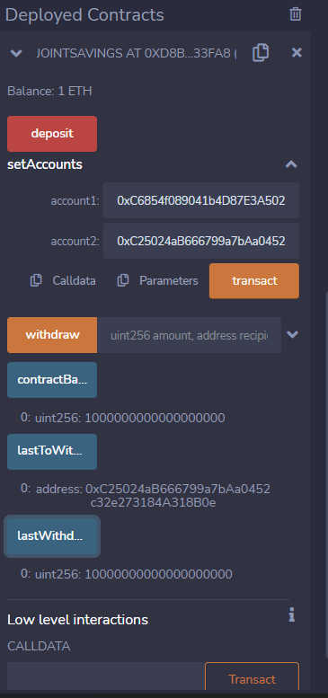

# Solidity-Joint-savings

A smart contract in Solidity to automate the creation of joint savings accounts, that accepts two user addresses that are then able to control a joint savings account. It uses ether management functions to implement various requirements from the financial institution to provide the features of the joint savings account.
## Setup
This uses Solidity with version 0.5.0 Pragma  in Remix IDE and can be run entirely in there or connected to a wallet such as Metamask

## In summary

It has two payable addresses that can be set up to deposit or withdraw.

Functionality includes account balance, last transaction and last to use account. 

There is two requirements that need to be met with regards account authorisation and funds availability.

There is also a default fallback function

